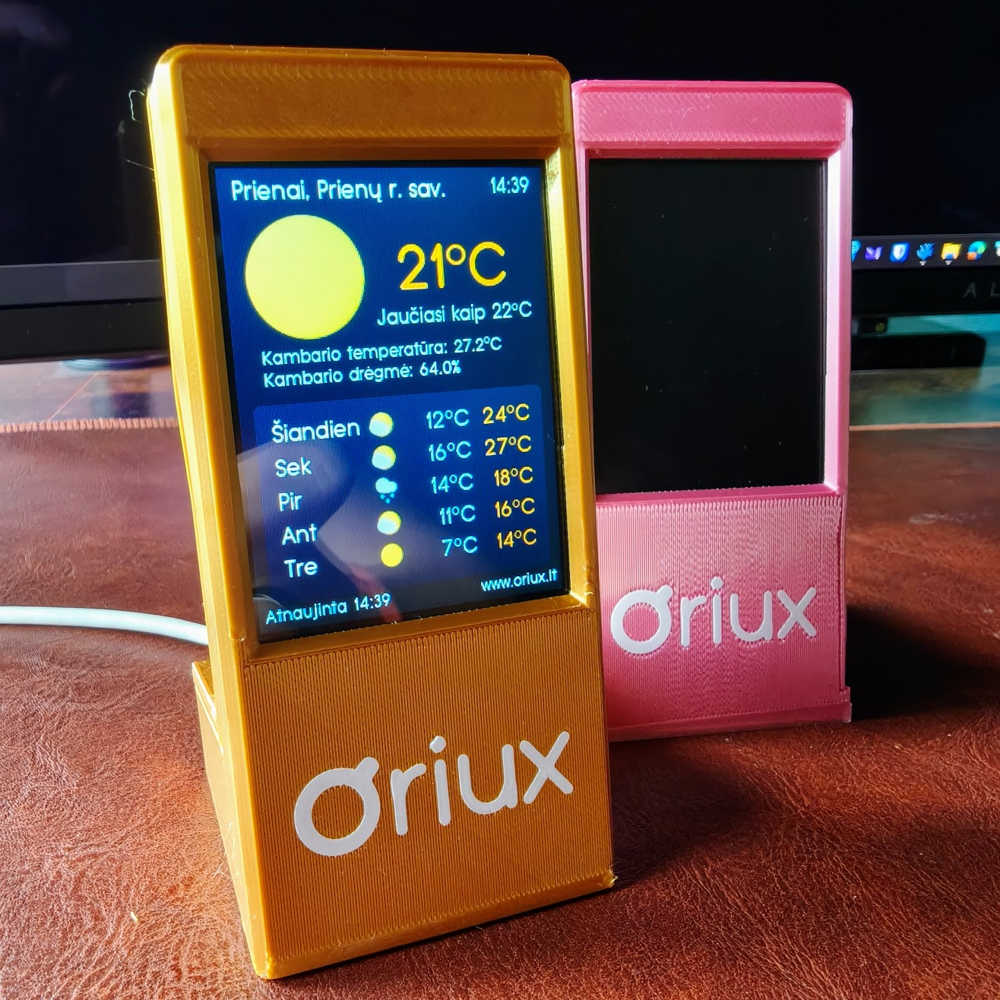
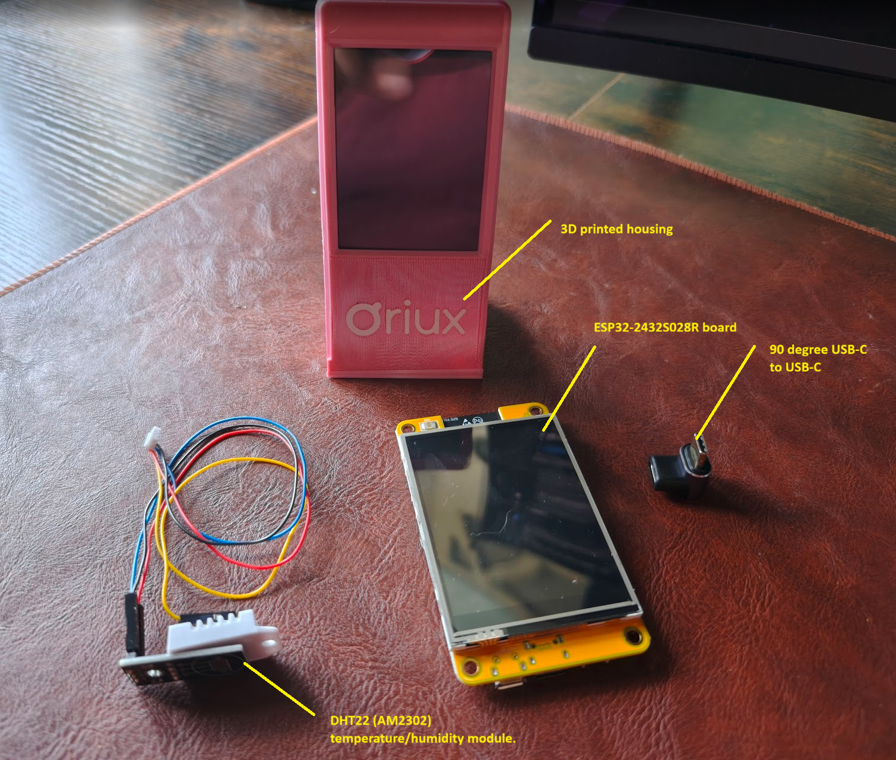

# Oriux: A DIY Physical Weather Station



Oriux is a simple weather widget that runs on the **ESP32-2432S028R** (ILI9341, 2.8" touch), also known as the "Cheap Yellow Display" (CYD). It shows current conditions, a 5‑day forecast, and room temperature/humidity from a DHT22 sensor, using LVGL for the UI.

## Quick Start Guide

This guide provides step-by-step instructions to get your Oriux weather station running.

### Hardware Requirements

*   **ESP32-2432S028R** development board (2.8" ILI9341 touch screen).
*   **DHT22 (AM2302)** temperature/humidity module.
*   **90 degree USB-C to USB-C adapter**
*   **Wiring:**
    *   DHT22 signal → ESP32 GPIO 22
    *   DHT22 VCC → 3.3V
    *   DHT22 GND → GND
All items can purchased on Aliexpress for ~20-25 EUR. 



### Software Requirements

*   **Arduino IDE** (version 2.x or newer is recommended).

### Project Setup and Installation

1.  **Open the Project:**
    *   Start the Arduino IDE.
    *   Go to `File` → `Open` and select the `weather/weather.ino` file directly from this repository.
    *   **Important:** Do not copy the `weather/` folder into your Arduino sketchbook. The project should be built from its repository location.

2.  **Install ESP32 Board Support:** (One-time setup)
    *   Go to `File` → `Preferences`.
    *   In the "Additional Boards Manager URLs" field, add the following URL:
        ```
        https://dl.espressif.com/dl/package_esp32_index.json
        ```
    *   Go to `Tools` → `Board` → `Boards Manager...`, search for "**esp32**" by Espressif, and click **Install**.

3.  **Install Required Libraries:**
    *   In the Arduino IDE, go to `Sketch` → `Include Library` → `Manage Libraries...`.
    *   Install the following libraries, ensuring you select the exact versions specified:
        *   `ArduinoJson` version **7.4.1**
        *   `HttpClient` version **2.2.0**
        *   `TFT_eSPI` version **2.5.43**
        *   `WiFiManager` version **2.0.17**
        *   `XPT2046_Touchscreen` version **1.4**
        *   `lvgl` version **9.2.2**
        *   `DHT sensor library` version **1.4.6**
        *   `Adafruit Unified Sensor` version **1.1.14**

4.  **Copy Configuration Files:**
    *   After installing the libraries, you must copy the provided configuration files into the library folders to overwrite the defaults.
    *   **TFT_eSPI Config:**
        *   Copy `TFT_eSPI/User_Setup.h` from this repository.
        *   Paste and overwrite it at:
            *   **Windows:** `C:\Users\YOUR_USER\Documents\Arduino\libraries\TFT_eSPI\User_Setup.h`
            *   **Linux:** `~/Arduino/libraries/TFT_eSPI/User_Setup.h`
    *   **LVGL Config:**
        *   Copy `lvgl/src/lv_conf.h` from this repository.
        *   Paste and overwrite it at:
            *   **Windows:** `C:\Users\YOUR_USER\Documents\Arduino\libraries\lvgl\src\lv_conf.h`
            *   **Linux:** `~/Arduino/libraries/lvgl/src/lv_conf.h`
    *   **Note:** Restart the Arduino IDE after copying the files.

### Build and Upload

1.  **Set Board Configuration:**
    *   `Tools` → `Board`: Select **"ESP32 Dev Module"**.
    *   `Tools` → `Partition Scheme`: Select **"Huge App (3MB No OTA/1MB SPIFFS)"**.

2.  **Build and Upload:**
    *   Connect your **ESP32-2432S028R** board to your computer via USB.
    *   Click the **Verify** button (checkmark icon) to compile the sketch.
    *   Click the **Upload** button (right arrow icon) to flash the firmware to the device.
    *   You can open the **Serial Monitor** at **115200 baud** to view debug output.

### First-Time Wi-Fi Setup

*   On its first boot, the device will create a Wi-Fi Access Point named **"Oriux"**.
*   Connect to this network from your phone or computer.
*   A captive portal should open automatically. If not, open a web browser and navigate to `http://192.168.4.1`.
*   Follow the on-screen instructions to connect the device to your local Wi-Fi network. It will save the credentials and reboot.

## 3D-Printed Housing

A custom-designed enclosure is available for this project.

*   **Models:**
    *   `3D_models/Oriux_3D_model.stl`: Standard file for most slicers.
    *   `3D_models/Oriux_3D_model.3mf`: Recommended for Bambu Lab printers, includes settings for a multi-color logo with an AMS.
*   **Print Settings:**
    *   **Material:** PLA
    *   **Layer Height:** 0.12 mm
    *   **Build Plate:** Smooth High-Temperature Plate recommended.
*   **More Info:**
    *   For a generic version without the logo and for full assembly instructions, visit the project page on MakerWorld: [Oriux Smart Weather Forecast Display](https://makerworld.com/en/models/1382304-oriux-smart-weather-forecast-display).

## Advanced Section

### Generating Custom Fonts (Optional)

The firmware includes pre-rendered fonts for English and Lithuanian. If you wish to use a different font, change sizes, or add new characters, you must regenerate the font files.

*   **Requirements:**
    *   Node.js and npm (for `npx`).
    *   Python 3.
*   **Process:**
    1.  Edit the `font_path` in `FONT/font_generator.py` to point to your `.otf` or `.ttf` font file.
    2.  Modify the character list in `weather/required_chars.txt` if needed.
    3.  Run the script from the repository root: `python FONT/font_generator.py`.
    4.  The script will generate new `.c` files in the `weather/` directory.
    5.  If you change font names or sizes, update the `LV_FONT_DECLARE` statements and `get_font_*` functions in `weather/weather.ino`.

### Project Details

*   **Pin Configuration:** Display and touch pins are defined in `TFT_eSPI/User_Setup.h`.
*   **LVGL Configuration:** UI settings are controlled by `lvgl/src/lv_conf.h`.
*   **Validation:** After flashing, check that the device boots, the captive portal works, all settings are functional, and sensor data is displayed correctly.

## Credits and License

*   **Code (`weather.ino`):** Licensed under the [GPL-3.0 License](https://www.gnu.org/licenses/gpl-3.0.en.html).
*   **Icons:** Weather icons are from [google-weather-icons](https://github.com/mrdarrengriffin/google-weather-icons/tree/main/v2) and are not covered by the GPL license.
*   **Libraries and Resources:** This project relies on the great work from LVGL, TFT_eSPI, witnessmenow, Random Nerd Tutorials, and the creators of the Arduino libraries listed above.

## Repository File Structure

### Core Files
*   `README.md`: This file.
*   `3D_models/`: Contains `.stl` and `.3mf` files for the enclosure.
*   `FONT/`: Tools and source font for generating custom LVGL fonts.
*   `lvgl/`, `TFT_eSPI/`: Pre-configured library files for this specific hardware.
*   `photo/`: Images for the README.
*   `weather/`: The main Arduino sketch and its components.
    *   `weather.ino`: The main application source code.
    *   `translations.h`: Language definitions.
    *   `required_chars.txt`: Characters to include in the font.
    *   `extract_unicode_chars.py`: A helper script for font generation.

### Helper Assets (in `weather/` directory)
*   **Weather Icons:** `icon_*.c` files.
*   **Weather Images:** `image_*.c` files.
*   **Generated Fonts:** `lv_font_typo_grotesk_rounded_*.c` files.
