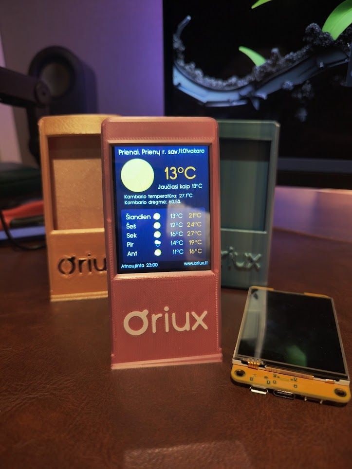

# Oriux

[IMG20250919230113.jpg](photo/IMG20250919230113.jpg)

Oriux is a simple weather widget that runs on the ESP32-2432S028R (ILI9341, 2.8" touch) a.k.a. Cheap Yellow Display (CYD). It shows current conditions, a 5‑day forecast, and room temperature/humidity with a DHT22 sensor, using LVGL for the UI.

--------------------------------------------------------------------------------

Quick Start

1) Hardware
- ESP32-2432S028R development board (2.8" ILI9341 touch)
- DHT22 AM2302 temperature/humidity module
  - Wiring used by firmware:
    - DHT22 signal → ESP32 GPIO 22
    - DHT22 VCC → 3.3V
    - DHT22 GND → GND
    - If you’re using a bare DHT22 (not a module), add a 10k pull-up from signal to 3.3V.

2) Software
- Arduino IDE (2.x recommended)

3) Open the project
- Start Arduino IDE.
- File → Open → select [weather.ino](weather/weather.ino) directly from this repository.
- Note: do not copy the weather/ folder into your Arduino sketchbook. Build from this repo in place.

4) Install ESP32 boards support (one-time in Arduino IDE)
- File → Preferences → “Additional Boards Manager URLs” → add:
  https://dl.espressif.com/dl/package_esp32_index.json
- Tools → Board → Boards Manager… → search “esp32” by Espressif → Install.

5) Install required libraries (exact versions)
- Arduino IDE → Sketch → Include Library → Manage Libraries… then install:
  - ArduinoJson 7.4.1
  - HttpClient 2.2.0
  - TFT_eSPI 2.5.43
  - WiFiManager 2.0.17
  - XPT2046_Touchscreen 1.4
  - lvgl 9.2.2
  - DHT sensor library 1.4.6
  - Adafruit Unified Sensor 1.1.14

6) Copy the provided LVGL and TFT_eSPI config files
Install the libraries first so their folders exist, then overwrite the files below.

- Copy [User_Setup.h](TFT_eSPI/User_Setup.h) → TFT_eSPI library config:
  - Windows: C:\Users\YOUR_USER\Documents\Arduino\libraries\TFT_eSPI\User_Setup.h
  - Linux:  ~/Arduino/libraries/TFT_eSPI/User_Setup.h

- Copy [lv_conf.h](lvgl/src/lv_conf.h) → LVGL library config:
  - Windows: C:\Users\YOUR_USER\Documents\Arduino\libraries\lvgl\src\lv_conf.h
  - Linux:  ~/Arduino/libraries/lvgl/src/lv_conf.h

Notes:
- Overwrite existing files when prompted.
- Restart Arduino IDE after copying.

7) Arduino IDE settings
- Tools → Board: “ESP32 Dev Module”
- Tools → Partition Scheme: “Huge App (3MB No OTA/1MB SPIFFS)”
- Keep other defaults.

8) Build and upload
- Connect the ESP32-2432S028R via USB.
- Click Verify (compile). Then click Upload.
- Open Serial Monitor at 115200 baud if needed.

9) First run and Wi‑Fi setup
- On first boot the device starts a Wi‑Fi AP named “Oriux”.
- Connect to it and open http://192.168.4.1
- Enter your Wi‑Fi credentials. Device will reboot and display weather shortly.

--------------------------------------------------------------------------------

Generating or modifying fonts (optional)

This project ships with prebuilt LVGL fonts for English and Lithuanian. If you change font, size, or Unicode coverage, regenerate the font C files.

What you need
- Node.js + npm (to run lv_font_conv via npx)
- Python 3

Files to use
- Font generator script: [font_generator.py](FONT/font_generator.py)
- Default font file: [Typo Grotesk Rounded.otf](FONT/Typo Grotesk Rounded.otf)
- Required glyph list (editable): [required_chars.txt](weather/required_chars.txt)
- Optional helper to extract used characters: [extract_unicode_chars.py](weather/extract_unicode_chars.py)

Steps
1) Edit [font_generator.py](FONT/font_generator.py)
   - Set font_path to the absolute path of your font file, for example:
     - On Windows: "C:\\Users\\YOUR_USER\\...\\Typo Grotesk Rounded.otf"
     - On Linux: "/home/YOUR_USER/.../Typo Grotesk Rounded.otf"
   - Or point it to the repo font: [Typo Grotesk Rounded.otf](FONT/Typo Grotesk Rounded.otf)

2) Ensure “lv_font_conv” is available to npx
   - Option A (recommended): use npx automatically during the script run
   - Option B: npm install -g lv_font_conv

3) Run the generator
   - From the repository root:
     - Windows/Linux: python FONT/font_generator.py

4) Results
   - New C files are written into [weather/](weather/) e.g.:
     - [lv_font_typo_grotesk_rounded_12.c](weather/lv_font_typo_grotesk_rounded_12.c)
     - [lv_font_typo_grotesk_rounded_14.c](weather/lv_font_typo_grotesk_rounded_14.c)
     - [lv_font_typo_grotesk_rounded_16.c](weather/lv_font_typo_grotesk_rounded_16.c)
     - [lv_font_typo_grotesk_rounded_20.c](weather/lv_font_typo_grotesk_rounded_20.c)
     - [lv_font_typo_grotesk_rounded_42.c](weather/lv_font_typo_grotesk_rounded_42.c)

5) Updating the code (if you changed names/sizes)
   - Font declarations live near the top of [weather.ino](weather/weather.ino):
     - [LV_FONT_DECLARE(lv_font_typo_grotesk_rounded_12)](weather/weather.ino:40)
   - Font selection helpers are defined here:
     - [get_font_12()](weather/weather.ino:49)

--------------------------------------------------------------------------------

Notes, pins, and drivers

- Display and touch pins are configured in [User_Setup.h](TFT_eSPI/User_Setup.h). Defaults used:
  - TFT_MISO: 12, TFT_MOSI: 13, TFT_SCLK: 14
  - TFT_CS: 15, TFT_DC: 2, TFT_RST: -1 (tied to board reset)
  - TOUCH_CS: 33, Backlight: GPIO 21
- LVGL is configured via [lv_conf.h](lvgl/src/lv_conf.h). LV_COLOR_DEPTH=16, ILI9341 enabled.

--------------------------------------------------------------------------------

3D-printed housing

Models
- [Oriux_3D_model.stl](3D_models/Oriux_3D_model.stl) - For any other software.
- [Oriux_3D_model.3mf](3D_models/Oriux_3D_model.3mf) - If you have Bambu printer. Recommended. AMS recomended to have logo. 

Recommended print settings:
- Material: PLA
- Layer height: 0.12 mm
- Plate: Smooth high temperature

Generic version wihout the logo:
- https://makerworld.com/en/models/1382304-oriux-smart-weather-forecast-display

--------------------------------------------------------------------------------

Validation checklist (after flashing)
- Device boots and shows splash/setup screen
- Captive portal reachable at http://192.168.4.1
- Location search, brightness, language, units (°C/°F), 12/24h toggles working
- DHT22 readings visible on screen
- 5-day forecast shows icons and values
- Night mode dims screen between 22:00 and 06:00 (configurable in code)

--------------------------------------------------------------------------------

Credits
- Project is based on:
  - MakerWorld project page: https://makerworld.com/en/models/1382304-oriux-smart-weather-forecast-display
- Weather icons: https://github.com/mrdarrengriffin/google-weather-icons/tree/main/v2
- LVGL UI framework: https://lvgl.io/
- CYD reference and tooling by witnessmenow:
  - https://github.com/witnessmenow/ESP32-Cheap-Yellow-Display
  - https://github.com/witnessmenow/ESP-Web-Tools-Tutorial
- Random Nerd Tutorials LVGL resources:
  - https://randomnerdtutorials.com/esp32-cyd-lvgl-line-chart/
- Libraries:
  - ArduinoJson: https://arduinojson.org/
  - HttpClient: https://github.com/amcewen/HttpClient
  - TFT_eSPI: https://github.com/Bodmer/TFT_eSPI
  - WiFiManager: https://github.com/tzapu/WiFiManager
  - XPT2046_Touchscreen: https://github.com/PaulStoffregen/XPT2046_Touchscreen
  - LVGL: https://lvgl.io/

License
- Code in [weather.ino](weather/weather.ino) is GPL-3.0.
- Icons not covered by GPL; see Credits.

--------------------------------------------------------------------------------

Full repository file tree (core)

- [README.md](README.md)
- [3D_models/](3D_models/)
  - [Oriux_3D_model.3mf](3D_models/Oriux_3D_model.3mf)
  - [Oriux_3D_model.stl](3D_models/Oriux_3D_model.stl)
- [FONT/](FONT/)
  - [font_generator.py](FONT/font_generator.py)
  - [Typo Grotesk Rounded.otf](FONT/Typo Grotesk Rounded.otf)
- [lvgl/](lvgl/)
  - [src/](lvgl/src/)
    - [lv_conf.h](lvgl/src/lv_conf.h)
- [photo/](photo/)
  - [IMG20250919230113.jpg](photo/IMG20250919230113.jpg)
- [TFT_eSPI/](TFT_eSPI/)
  - [User_Setup.h](TFT_eSPI/User_Setup.h)
- [weather/](weather/)
  - [weather.ino](weather/weather.ino)
  - [translations.h](weather/translations.h)
  - [required_chars.txt](weather/required_chars.txt)
  - [extract_unicode_chars.py](weather/extract_unicode_chars.py)

Helper assets and generated files (not individually listed)

- Weather icon assets in [weather/](weather/): files prefixed with "icon_" (*.c)
- Weather image assets in [weather/](weather/): files prefixed with "image_" (*.c)
- Generated fonts in [weather/](weather/): files prefixed with "lv_font_typo_grotesk_rounded_" (*.c)
